# Information-security-system-for-electronic-document-management
**Система защиты информации при организации электронного документооборота**

<div align="center">
  
  
  

  [Главная страница](#Главная-страница) • 
  [Регистрация](#Регистрация) •  
  [Авторизация](#Авторизация) •
  [Обмен ключами](#Обмен-ключами) •
  [Модуль шифрования](#Модуль-шифрования) •
  [Модуль ЭП](#Модуль-ЭП) •
  [Модуль ЦВЗ](#Модуль-ЦВЗ) •
  
</div>

#

Для работы программного средства необходимо установить следующие фреймворки и библиотеки:

*Django* - свободный фреймворк для создания веб-приложений

```sh
pip3 install django
```

*hashlib* - позволяет реализовывать различные безопасные алгоритмы хэширования

```sh
pip3 install hashlib
```

*transliterate* - представляет собой двунаправленный транслитератор текста

```sh
pip3 install transliterate
```

*SymPy* - используется для символьных вычислений и представляет возможности компьютерной алгебры

```sh
pip3 install sympy
```

*PIL* - предназначена для работы с растровой графикой

```sh
pip3 install pillow
```

*NumPy* - предоставляет возможности работы с многомерными массивами (включая матрицы) и высокоуровневыми математическими функциями

```sh
pip3 install numpy
```

#

# Главная страница

Демонстрация главной страницы

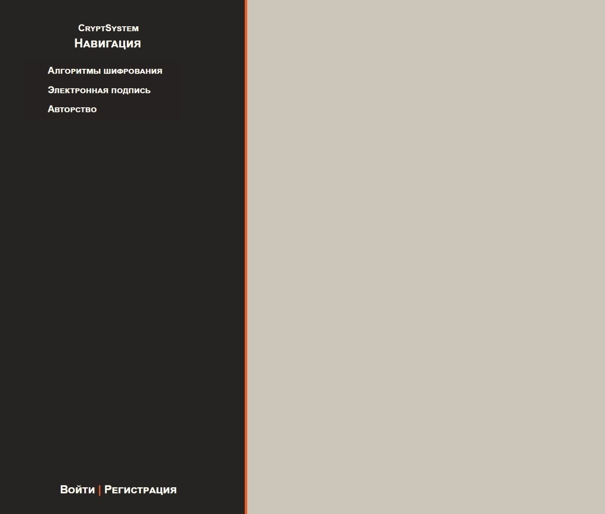

#

# Регистрация

Демонстрация окна регистрации

Во время регистрации пользователю необходимо ввести следующие данные. Так как в системе очень многое завязано на пароле, пользователь должен придумать сложный пароль для большей безопасности своего аккаунта. Рекомендуется использовать надежные генераторы сложных паролей, к примеру *Kaspersky password manager*.

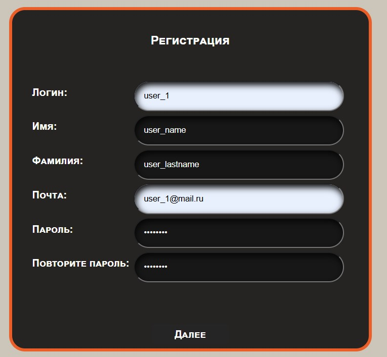

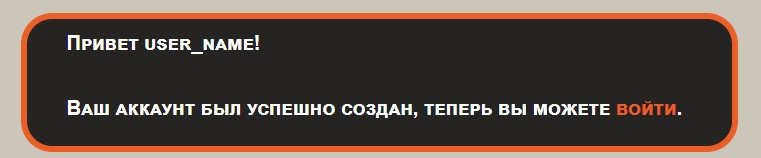

#

# Авторизация.

Демонстрация окна авторизации

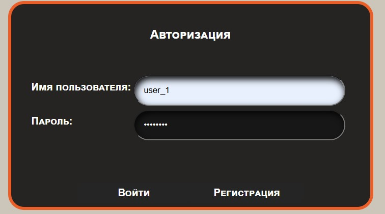

#

# Обмен ключами

Демонстрация окна обмена ключами

При обмене ключами шифрования пользователь указывает логин другого пользователя, кому он хочет отправить запрос и пароль.

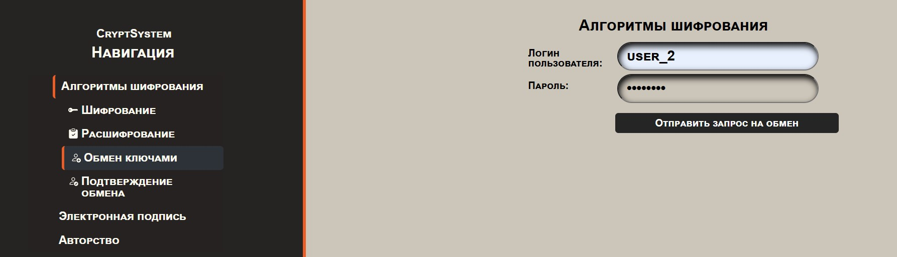

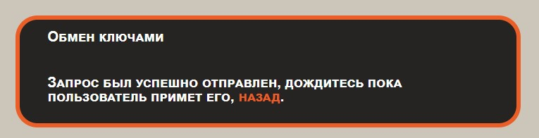

Для продолжения обмена другому пользователю необходимо ввести логин отправителя и пароль.

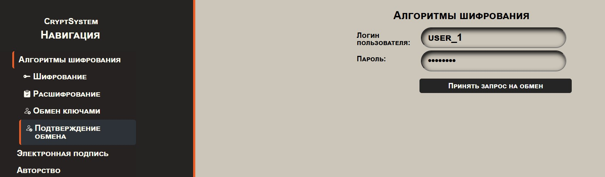


#

# Модуль шифрования

Демонстрация окна шифрования

При шифровании пользователь вводит открытый текст в соответствующее поле, логин пользователя, кому он в дальнейшем будет отправлять зашифрованный текст, а также пароль для вычисления ключа шифрования алгоритмом Диффи-Хеллмана. После проверки корректности введенного пароля сервер также проверит был ли произведен обмен ключами с указанным пользователем. Если все корректно, то сервер зашифрует сообщение алгоритмом шифрования Магма и отправит пользователю файл с зашифрованным текстом.

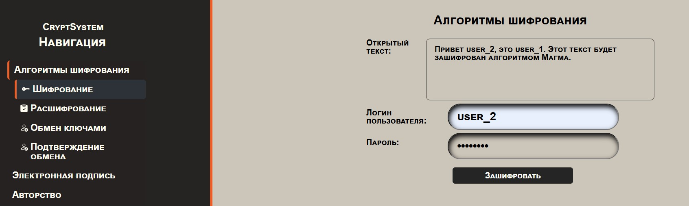

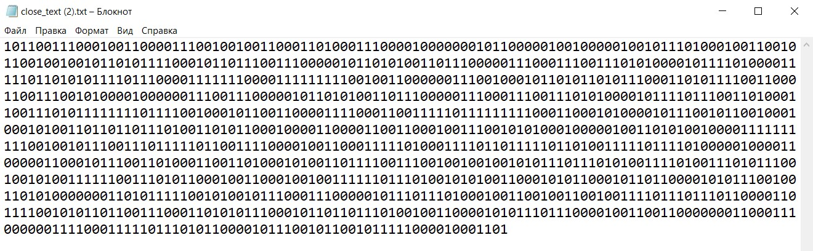

Для расшифрования необходимо приложить зашифрованный файл, ввести логин отправителя этого файла и пароль. После расшифрования сообщение будет выведено на экран пользователя.

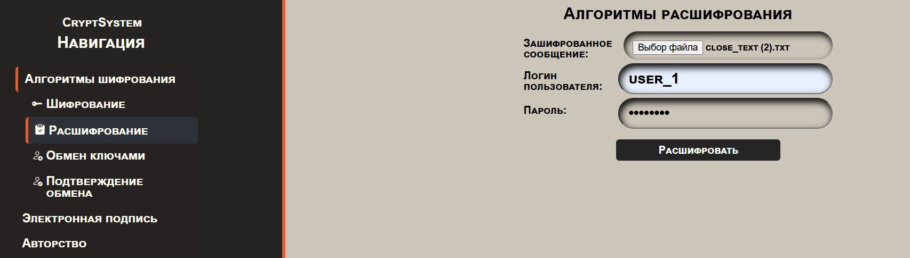

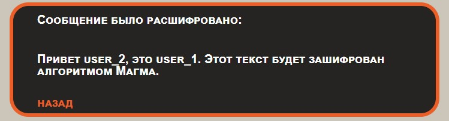

#

# Модуль ЭП

При создании электронной подписи пользователь прикладывает документ, который необходимо подписать и вводит пароль, который будет использоваться для расшифрования закрытого ключа, который хранится на сервере. После подписания документа пользователю будет отправлен файл с расширением – .sig, в котором и будет храниться электронная подпись.

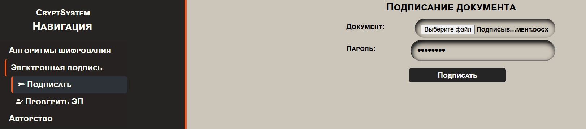

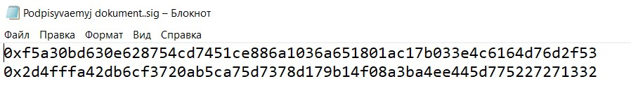

Для проверки электронной подписи пользователь должен приложить документ и саму электронную подпись, а также указать логин пользователя, подписавшего данный документ. После проверки сервер выведет на экран пользователя действительна эта подпись или нет.

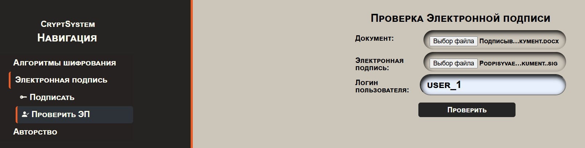


#

# Модуль ЦВЗ

При внедрении авторства от необходимо приложить картинку с расширением – .bmp и ввести пароль для подтверждения его личности, после проверки сервер внедрит имя и фамилию автора в картинку и отправит ее пользователю. Для проверки авторства необходимо приложить картинку. Сервер выведет на экран пользователя автора данной картинки, а если авторства не будет обнаружено, то сервер выведет и это.

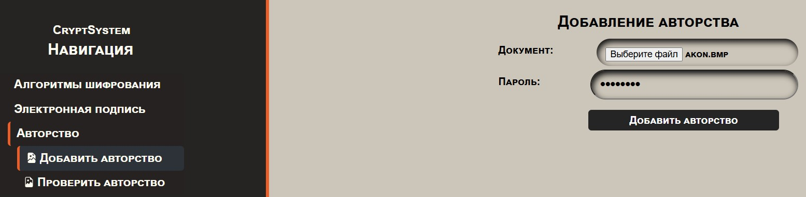

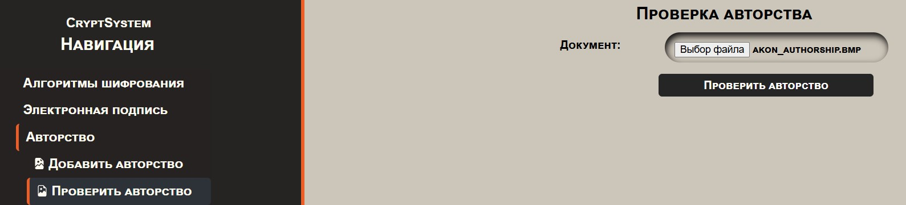


## Авторы

* **Михаличев Олег** - [GitHub](https://github.com/pettyderf)

## License

This project is licensed under the GNU ver.3 License.
